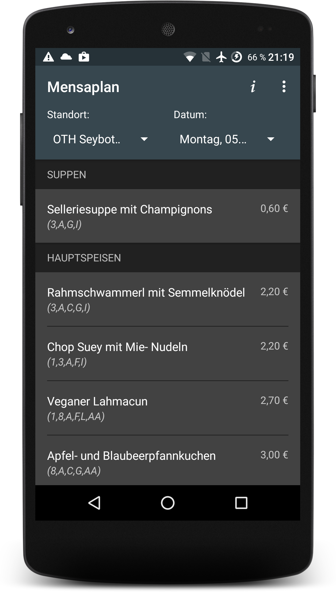
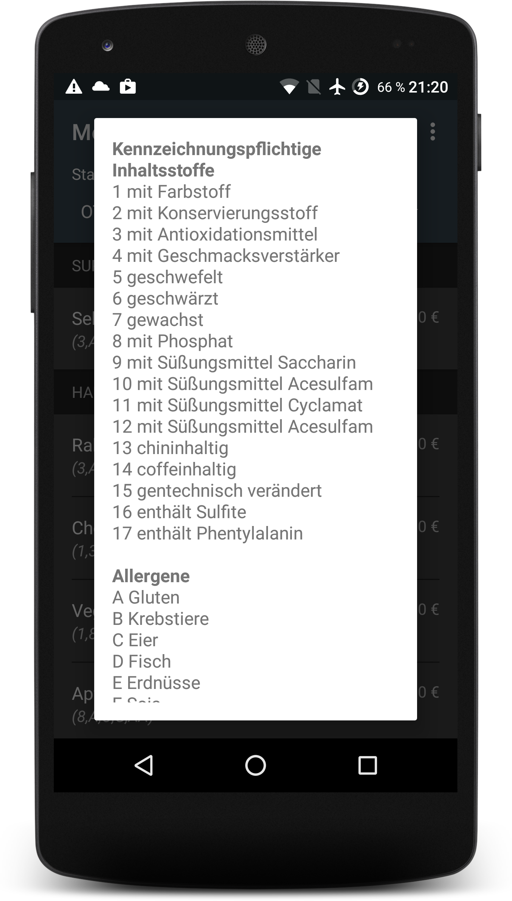
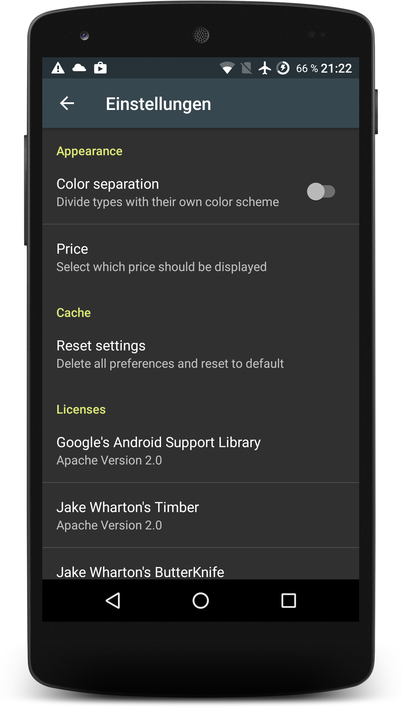
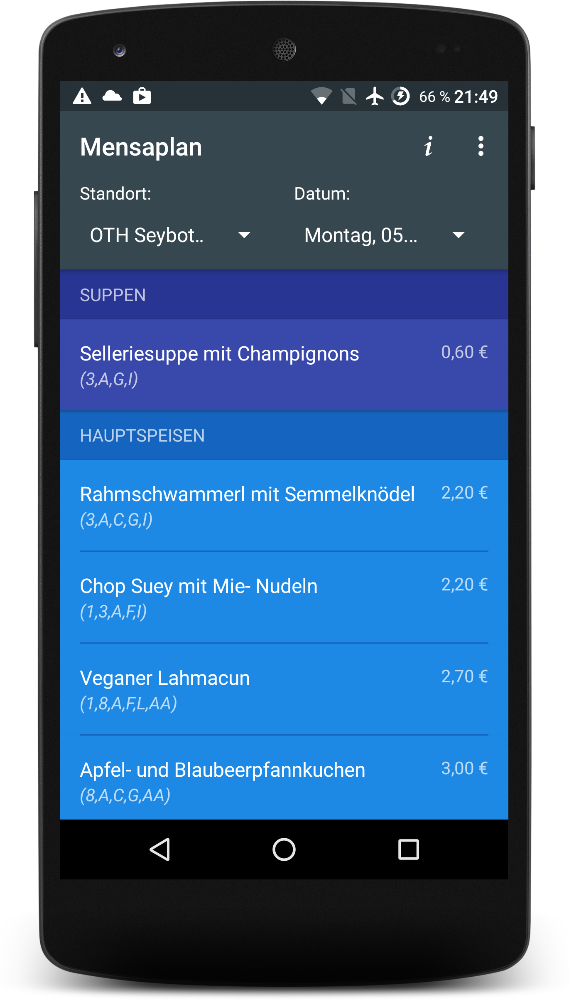
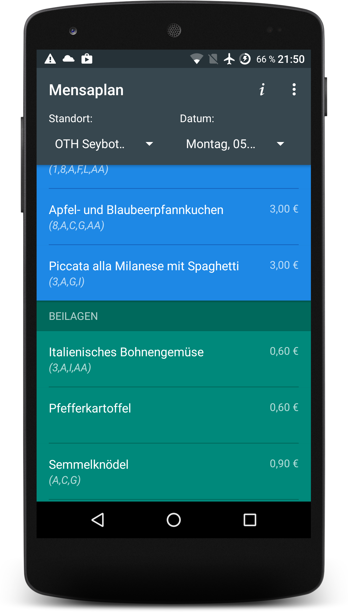
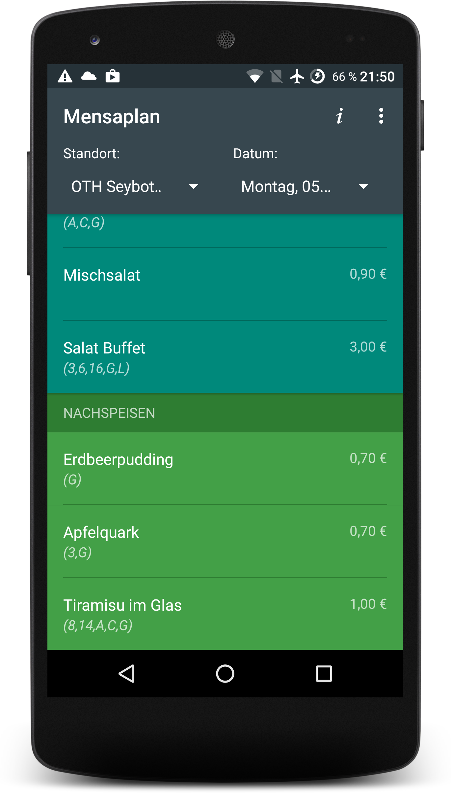

#  Mensaplan
Eine kleine native Android Applikation, welche den wöchentlichen Speiseplan von verschiedenen Mensas in Regensburg anzeigt.

## Unterstütze Standorte
+ OTH Seybothstraße (auch Abends)
+ OTH Prüfening
+ Universität

## Features
+ Dynamisch änderbarer Standort und Wochentag
+ Speicherung des Speiseplans beim ersten Aufruf im internen Cache
+ Buntes Farbschema für den Speiseplan (siehe Screenshots)
+ Wählbare Preisanzeige zwischen Student, Mitarbeiter, Gast und Generell
+ Beschreibung von Gerichten zeigt enthaltene (Allergene-) Inhaltsstoffe

## Screenshots

&nbsp;
&nbsp;

&nbsp;
&nbsp;

## Todo
+ Wecken, wenn ein bestimmtes Gericht auf dem Speiseplan steht
+ Speiseplan von letzter Woche aus dem Cache löschen
+ ~~Letzten Standort als Standard festlegen~~
+ Backport zu Android 4.1 Jelly Bean (sdk16)
+ Implementierung von Instumental-Tests
+ Veröffentlichung im Google Play Store
+ Veröffentlichung im F-Droid Market
+ Vollständige Orientierung an Google's Material Design
+ Card-Design für den wöchentlichen Speiseplan

## Lizenz
Copyright (c) 2015 Lukas 'dotwee' Wolfsteiner

Binaries und Quellcode können nach den Regeln der [Apache License, Version 2.0](LICENSE) benutzt werden.